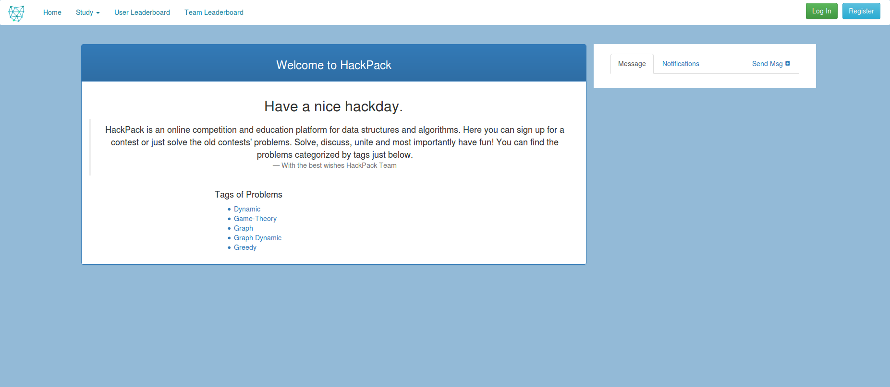

Parts Implemented by Ezgi Yılmaz
================================

**TEAM**

In HackPack we are supporting users to have a team. Because team work is very important in life and competitive
programming. If you want to create or join a team and solve together with your friends you can go to your profile and
enter the team name the given area. If there is a team named like this you will added to it, if don't it will be
created for you and your friends.

