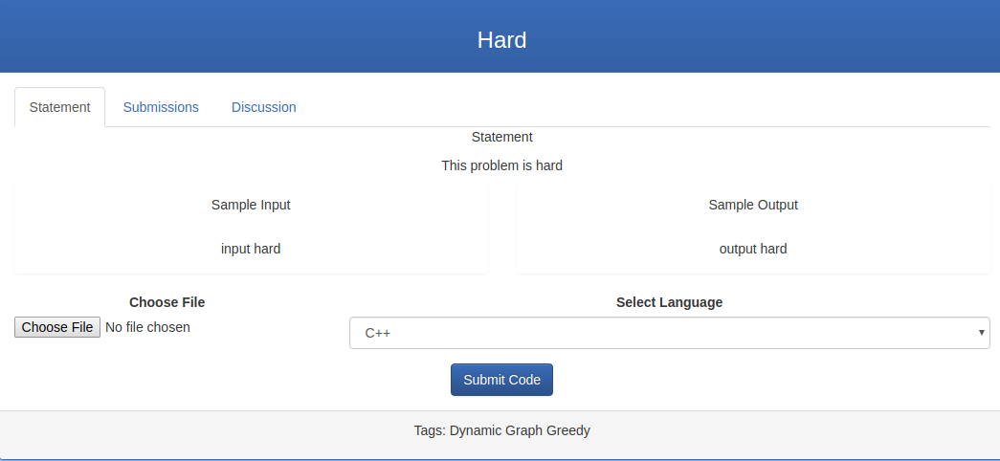

Parts Implemented by M. Burak Buğrul
====================================

**Problem-input-submission interaction handled by M. Burak Buğrul**

Problem Page
------------

There are 3 tabs in the problem page. Problem statement, submissions and discussions. One can read the problem and submit
a solution in first tab, see his/her results ins the second tab and discuss the problem in the third tab. First two tabs
are implemented by me.

Problem Statement
-----------------

You can view the problem in this tab

Submissions
-----------

You can check your results here

.. figure:: submission_tab.png
    :scale: 100 %
    :alt: Submission results.

Problem Lists
-------------

There are 3 types of problem lists:
List by tag
List by contest
List all

Admin Problem-Input Adding
--------------------------

.. figure:: add_problem.png
    :scale: 100 %
    :alt: Add a Problem.

Contest Leaderboard by Submissions
----------------------------------

.. figure:: add_problem.png
    :scale: 100 %
    :alt: Add a Problem.
