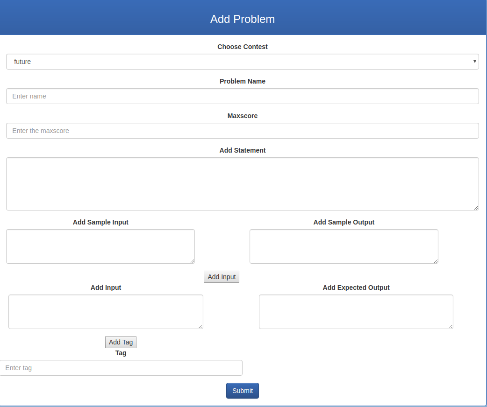

Parts Implemented by Oğuz Paksoy
================================

**Contest-clarification interactions, messages and tags are handled by Oğuz Paksoy**

Contest List
------------

You can list contests and register to them.

Creating a Contest
------------------

Admins can add new contests

.. figure:: add_contest.png
    :scale: 100 %
    :alt: Adding contest.

Clarification View
------------------

Message View
------------

YOu can read your messages.

Sending a Message
-----------------

YOu can send messages.

Sending a Clarification
-----------------------

Admins can send clarifications to contestants of a specific contest.

Adding Tags to a Problem
------------------------

Tag List at Home Page
---------------------

.. figure:: home.png
    :scale: 100 %
    :alt: Tags.
